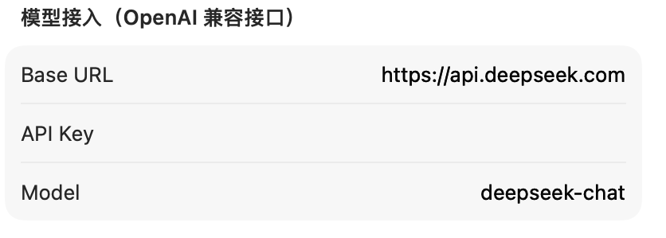
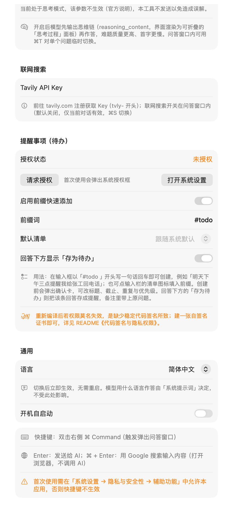
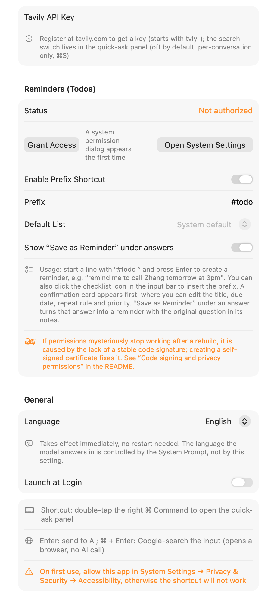

# AI Quick Ask (macOS)

**English** | [简体中文](README_CN.md)


A native macOS AI quick-ask tool: **no launcher window, no Dock icon** — it lives in the menu bar. Hit a global hotkey to pop up an input field, and the answer streams back from your LLM.

The design goal is "ask the moment you think of it" — no switching windows, no hunting for an input box, no picking a model. **Double-tap the right ⌘ Command** and start typing.

- **Fully native**: SwiftUI + AppKit, matching the macOS 26 Liquid Glass look, zero third-party dependencies
- **No Xcode required**: compiled directly with `swiftc`; a single `make` command produces the app
- **Model-agnostic**: OpenAI-compatible API — works with DeepSeek, Qwen, Kimi, OpenAI, and others
- **Bilingual**: Simplified Chinese and English UI, switchable at runtime with no restart — and the prompts sent to the model switch with it
- **Actually useful**: save any answer straight into system Reminders; a one-liner starting with `#todo` becomes a reminder

---

## Features

| Capability | Description |
|------|------|
| **Global hotkey** | Double-tap the right ⌘ Command to show/hide the panel, from any app |
| **Streaming output** | SSE token-by-token rendering, stoppable mid-flight; a glowing edge line indicates loading |
| **Multi-turn chat** | Context accumulates; the whole history is sent back per the OpenAI spec |
| **Markdown rendering** | Headings, lists, tables, code blocks, blockquotes, plus inline formatting |
| **System prompt** | Toggleable and editable, with 6 built-in presets for different personas |
| **Thinking mode** | Aligned with DeepSeek's thinking-model docs; selectable effort, per-conversation override |
| **Web search** | Wired to Tavily; the answer carries a source list (collapsed by default, click to expand) |
| **Built-in browser** | Search results and source links open inside the panel — no jumping to your default browser |
| **Google search** | Press `⌘ Enter` to Google whatever is in the input box; results open in the built-in browser |
| **Reminders** | A `#todo` one-liner creates a system reminder; any answer can be saved as one |
| **Date awareness** | The current date is injected on every request, fixing the model's guesswork around "today" / "yesterday" |
| **Interface language** | Simplified Chinese / English, switchable in Settings and applied instantly without a restart — the presets and prompts sent to the model switch along with it |
| **Launch at login** | Implemented via a LaunchAgent; no extra permissions needed |
| **Borderless panel** | Liquid Glass background, draggable by empty space, auto-hides on focus loss |

## Screenshot

Fill in **Base URL / API Key / Model** and you're set (values below are examples):



---

## Requirements

| Item | Requirement |
|---|---|
| OS | **macOS 26.0 or later** |
| Toolchain | Command Line Tools (`xcode-select --install`) — full Xcode is not needed |

> **Why macOS 26?** The UI relies on `NSGlassEffectView`, `.buttonStyle(.glass)`, `onScrollGeometryChange` and other Liquid Glass APIs, with **no `#available` fallbacks**. Supporting older systems would mean adding downgrade branches for each of those calls.
>
> The minimum version is declared explicitly and kept in sync in three places: `MACOS_MIN` in the `Makefile`, `LSMinimumSystemVersion` in `Resources/Info.plist`, and `platforms` in `Package.swift`.

## Getting Started

### Build and run

```bash
git clone https://github.com/Atramp/Jarvis.git
cd Jarvis

make build     # or `make run` to build and launch immediately
```

`make build` is equivalent to:

```bash
swiftc -O -target arm64-apple-macos26.0 Sources/AIQuickAsk/*.swift \
       Sources/AIQuickAsk/ObjCExceptionCatcher.m \
       -import-objc-header Sources/AIQuickAsk/AIQuickAsk-Bridging-Header.h \
       -o build/AIQuickAsk
```

> Don't drop `-target`. Without it, `swiftc` uses your **local SDK version** as the minimum-OS prefix, so the same source tree produces apps that run on different OS versions depending on the machine.
>
> If you prefer SPM, `swift build -c release` works too (output in `.build/release/`).

### Bundle as a .app (recommended)

```bash
make bundle      # build → bundle → sign (produces build/AIQuickAsk.app)
make install     # plus copy to /Applications/AIQuickAsk.app and hot-restart (recommended)
```

`make install` is the **recommended path**: macOS ties privacy grants to the on-disk path, so pinning the `.app` to `/Applications` keeps them from being invalidated by `make clean` or by moving the folder. It copies with `ditto` so the signature's sealed resources survive.

### First-time setup

1. Once running, a ✨ icon appears in the menu bar. **Double-tap the right ⌘ Command** to bring up the input field.
2. Click ✨ → "设置…" (Settings, or `⌘,`) and fill in three fields:

   | Field | Default |
   |------|--------|
   | Base URL | `https://api.deepseek.com` |
   | API Key | your model API key |
   | Model | `deepseek-flash` |

3. Back in the input field, type a question and press Enter to watch the answer stream in.

> **Accessibility permission is required on first use** (System Settings → Privacy & Security → Accessibility), otherwise the global hotkey won't work. Without it you can still call up the panel manually via the menu bar ✨ → "打开问答窗口".

> **Note:** the app UI and the files under `docs/` are written in Chinese. The code, build system, and this README are fully usable regardless.

---

## Usage

### Keyboard shortcuts

| Action | Key |
|------|------|
| Show / hide the input panel | Double-tap the right ⌘ Command |
| Submit a question | Enter |
| Toggle thinking mode | `⌘T` |
| Toggle web search | `⌘S` |
| Google-search the input content | `⌘ Enter` |
| Embedded page: back / forward | `⌘[` / `⌘]` |
| Collapse the embedded page (back to chat) | `Esc` or the toolbar ✕ |
| Stop generating | Click "停止" (Stop) |
| Close the window | `⌘W` / `Esc` (collapses the page first if one is open) |

The double-tap detection lives in `Sources/AIQuickAsk/HotkeyManager.swift`: `rightCommandKeyCode` (right Command = `0x36`) and `doubleTapThreshold` (0.35 s by default).

### System prompt

Settings → **System prompt**. Customize the assistant's role and answer style.

| Option | Description |
|--------|------|
| Enable system prompt | **On** by default. When off, no system message is sent for the rest of the session |
| Presets | "通用问答 / 简洁直答 / 严谨考证 / 翻译助手 / 代码助手 / 详尽解读" — picking one fills the text box; editing it switches the dropdown to "自定义" (Custom) |
| Prompt text box | Multi-line and free-form, with a character count |
| Restore default | One click back to the built-in "通用问答" text |

The content is sent as a `system` message in the **first** position of `messages`. `/chat/completions` is stateless, so it is re-injected on every turn.

> **To get longer answers, change the persona — not the thinking effort.** In testing, switching to the "详尽解读" (in-depth) persona took answer length from 880 to 2,978 characters (~3.4×), while raising `reasoning_effort` only increased reasoning volume, barely the answer. See [docs/thinking-mode.md](docs/thinking-mode.md).

### Thinking mode

Settings → **Thinking mode**: on by default, effort `high`, `max_tokens` left at 0 (not sent, so the server decides its budget). Press `⌘T` in the panel to override it for the current turn.

The reasoning trace (`reasoning_content`) is **not rendered in the UI** — it only affects API behaviour (answer quality and time-to-first-token). The glowing edge line is the sole loading indicator. See [docs/thinking-mode.md](docs/thinking-mode.md).

### Web search

After adding a Tavily API key in Settings, press `⌘S` in the panel to enable it (**off by default**, and per-conversation only). Once on:

- the model searches first and answers from the retrieved results;
- the answer ends with "参考来源 · N 条" (N sources), **collapsed by default** — click the header to expand (per-answer, not inherited across turns);
- sources open in the built-in browser; hovering shows the full title and URL;
- each source's text excerpt (truncated to 300 characters) is added to the context.

### Reminders (`#todo`)

Type a one-liner starting with `#todo` and press Enter to create a system reminder:

```
#todo 明天下午三点提醒我给张工回电话
```

The flow is **extract → confirm → write**: the model turns natural language into structured fields, a confirmation card lets you edit them, and only then is it written via EventKit. A few rules are deliberately hard-coded:

- a date without a time = **all-day reminder**, with no 00:00 forced in;
- **never produce a reminder that's already in the past** (today + an elapsed time rolls forward one day);
- if no time can be extracted, keep the title only — **never invent a date**.

Every answer also has a "存为待办" (Save as reminder) button; the model only compresses a title, while the original answer text is written to the notes by the app itself. See [docs/todo.md](docs/todo.md).

### Built-in browser

Both `⌘Enter` search and clicking a "参考来源" entry **open inside the panel** rather than handing off to your default browser (the toolbar's Safari button is the only external escape hatch). In-page links and `target=_blank` new tabs stay in this same webview, and a two-finger swipe navigates back and forward.

The memory strategy is **destroy on collapse**: the webview is torn down entirely and its page memory is released immediately, so opening and closing it repeatedly doesn't accumulate.

### Date awareness

A model has no clock of its own and can only guess "today" from training-data priors, so relative expressions like "yesterday" or "recently" get computed against the wrong date. The app injects a separate `system` message on every request to correct this:

```
当前时间：2026-09-14 星期一（Asia/Shanghai，UTC+8）。
涉及「今天/昨天/明天/最近/前几天」等相对时间的表述，一律以上述时间为基准换算；
搜索结果未标明发布时间时，不要臆测日期。
```

By default this is **precise to the day** (the string doesn't change within a day, so prefix caching hits best). The hour and minute are added only when the question looks like it is asking for the current moment. The app matches **both** the Chinese and the English keyword lists (`现在 / 此刻 / 几点 / 刚刚` and `right now / what time / o'clock`), independent of the UI language — so "what time is it" still gets a minute-precise clock inside the Chinese UI.

### Interface language

The interface ships in **Simplified Chinese and English**. Settings → General → Language offers *Follow System* / *简体中文* / *English*, and switching takes effect **immediately, with no restart**.

- **Follow System** walks the macOS preferred-language list in order: any `zh*` matches Simplified Chinese, `en*` matches English, and anything else (Japanese, German, …) falls back to Simplified Chinese to match `CFBundleDevelopmentRegion`. Traditional Chinese currently falls back to Simplified rather than English, because there is no `zh-Hant` table yet.
- The localization covers **both the UI and the text sent to the model**. Persona presets, the search-context prompt, the date prompt and the `#todo` extraction prompt (few-shot examples included) all switch along with the interface, so an English UI really does behave like an English app rather than a translated shell.
- `#todo` time-phrase parsing and the "precise time" keyword tables recognise **Chinese and English input regardless of the UI language**.
- The language the model *answers* in is **not** controlled by this setting — that is the system prompt's job.

| Interface language: Simplified Chinese | Interface language: English |
|---|---|
|  |  |

Translations live in `Sources/AIQuickAsk/L10n.swift` (UI strings) and `Sources/AIQuickAsk/Prompts.swift` (model-facing text), not in `.lproj/Localizable.strings`. The reasoning, plus the recipe for adding a string, is in [docs/i18n.md](docs/i18n.md).

---

## Switching models

Change Base URL and Model in Settings. Common combinations:

| Provider | Base URL | Model |
|------|----------|-------|
| DeepSeek | `https://api.deepseek.com` | `deepseek-flash` |
| Qwen | `https://dashscope.aliyuncs.com/compatible-mode/v1` | `qwen-plus` |
| Kimi | `https://api.moonshot.cn/v1` | `moonshot-v1-8k` |
| OpenAI | `https://api.openai.com/v1` | `gpt-4o-mini` |

> `thinking` / `reasoning_effort` are DeepSeek-specific extensions. The app **only sends them to `deepseek.com`** and skips them for other providers, so servers that strictly validate unknown fields won't return a 400.
>
> DeepSeek's legacy model name `deepseek-chat` still works, but it is routed to `deepseek-flash` and billed as such — use `deepseek-flash` directly.

## Further reading

The documents below are currently written in Chinese.

| Document | Contents |
|------|------|
| [docs/architecture.md](docs/architecture.md) | Project layout, streaming strategy, edge-glow algorithm, embedded browser, state-management conventions |
| [docs/thinking-mode.md](docs/thinking-mode.md) | `thinking` / `reasoning_effort` config, removed no-op parameters, measured data |
| [docs/todo.md](docs/todo.md) | The three-step `#todo` pipeline, extraction accuracy, invariant rules |
| [docs/i18n.md](docs/i18n.md) | Why the tables are Swift code rather than `.lproj`, how language resolution works, what is and isn't localized, how to add a string |
| [docs/code-signing.md](docs/code-signing.md) | Why a self-signed certificate is needed, why TCC grants get invalidated, full fix steps |

## Self-test

The repo ships headless assertions — no network, runs in seconds:

```bash
./tools/selftest.sh                            # pure logic assertions (166 of them)

# additionally hit the real API for extraction tests (needs an API key)
AQA_LIVE=1 AQA_KEY="$(defaults read com.aiquickask.app apiKey)" ./tools/selftest.sh
```

Coverage includes prefix-matching boundaries, `TodoDraft` ↔ EventKit field mapping (including all-day semantics), `TodoParser` JSON decoding and the "never produce a missed reminder" invariant, request-body assembly, and the localization tables (full key coverage in both languages, no empty entries, matching `%d`/`%@` arity, and a scan proving no Chinese leaks into the English table).

`tools/` also holds harnesses for verifying invisible behaviour (compiled and run by hand, not part of `make`): `browser-perf-harness.swift` (embedded-browser memory and cold-start timing), `glow-verify/` (edge-glow geometry and speed measurement) and `i18n-snapshot/` (renders the settings page in both languages and dumps PNGs, which is how the English button-truncation bug was caught).

## Permissions and code signing

The app uses two privacy permissions: **Accessibility** (global hotkey) and **Reminders** (writing to-dos).

macOS ties a privacy grant to the **combination of code signature + bundle ID + on-disk path**. An unsigned build changes its cdhash on every recompile, so the system treats it as a brand-new app and the grant is lost — you'll see "the hotkey does nothing" or "the permission prompt never appears again".

**A self-signed certificate fixes this**, with no Apple Developer account required, in about two minutes. The full reproducible commands are in [docs/code-signing.md](docs/code-signing.md).

```bash
make bundle SIGN_IDENTITY="your certificate name"   # if missing, it doesn't fail — it skips signing and explains the trade-off
```

## Known limitations

- **macOS 26+ only**, with no fallback branches for older systems.
- **The UI ships in Simplified Chinese and English only.** Traditional Chinese currently resolves to Simplified rather than English, because there is no `zh-Hant` table yet.
- **Thinking parameters are only sent to DeepSeek endpoints** (matched by domain whitelist); making this configurable would mean changing `Config.isDeepSeekEndpoint`.
- **Web search is off by default** and requires your own Tavily API key.
- **Tavily's general search doesn't return publish dates**, so "is this article from yesterday" often can't be confirmed from the results alone (switch to `"topic": "news"` and `"days": N` in `TavilyClient`'s request body if you need it).
- Settings live in local `UserDefaults` (keys are in `Config.swift`) and the **API key is stored in plaintext**. Nothing is sent to any third party.

## Contributing

Issues and PRs are welcome. Please run `./tools/selftest.sh` before submitting; if you touch the build script (`Makefile`), read the comments first — they document several traps we've already hit (`find-identity` must not be called with `-v`, signing must happen after `Info.plist` is written, and so on). Don't "simplify" those away.

## License

[MIT](LICENSE)
