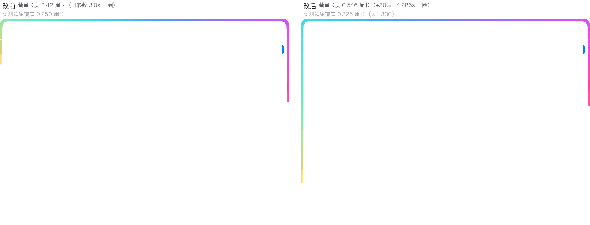

# 架构与实现要点

## 项目结构

```
ai-quick-ask/
├── Makefile                    构建 / 打包 / 签名 / 安装（不依赖 Xcode）
├── Package.swift               SPM 清单（可选构建路径）
├── Resources/
│   ├── Info.plist              LSUIElement=true（无 Dock 图标）+ 权限用途说明
│   └── AppIcon.icns
├── Sources/AIQuickAsk/
│   ├── AIQuickAskApp.swift          @main（只有 Settings scene）
│   ├── AppDelegate.swift            菜单栏图标、全局快捷键、面板与设置窗生命周期
│   ├── PopupPanel.swift             无边框浮动面板（NSPanel + 液态玻璃背景 + 拖动手柄）
│   ├── ContentView.swift            面板主视图：输入胶囊、消息流、边缘流光、内嵌网页
│   ├── ChatViewModel.swift          会话状态与流式节流（@Published，禁用 @State）
│   ├── LLMClient.swift              OpenAI 兼容 SSE 客户端 + 请求体组装（纯函数）
│   ├── TavilyClient.swift           联网搜索客户端与来源条目模型
│   ├── MarkdownRenderer.swift       Markdown → 块模型 → SwiftUI 视图
│   ├── HotkeyManager.swift          全局监听双击右侧 ⌘（CGEventTap）
│   ├── BrowserWindow.swift          内嵌 WKWebView 控制器与工具栏状态
│   ├── SettingsView.swift           设置页（模型 / 人设 / 思考 / 搜索 / 待办 / 语言 / 通用）
│   ├── Config.swift                 全部 UserDefaults 键与默认值的单一事实来源
│   ├── L10n.swift                   界面文案双语表 + 语言判定 + 运行时切换（见 docs/i18n.md）
│   ├── Prompts.swift                发给模型的文本（人设 / 时间 / 搜索 / 待办提示词）双语
│   ├── TodoParser.swift             自然语言 → TodoDraft（提示词 + JSON 解码 + 兜底）
│   ├── TodoDraft.swift              待办草稿数据载体（不依赖 EventKit，双通路共用）
│   ├── RemindersStore.swift         EventKit 读写封装
│   ├── LoginItemManager.swift       LaunchAgent 开机自启
│   ├── RemoteViewCrashGuard.swift   macOS 27 beta ViewBridge 断言兜底（swizzle）
│   ├── ObjCExceptionCatcher.{h,m}   NSException 捕获桥（Swift 不能 catch）
│   └── AIQuickAsk-Bridging-Header.h
├── docs/                       本文档与截图
└── tools/
    ├── selftest.sh             无头断言入口（166 项）
    ├── main.swift              断言实现
    ├── generate_icon.py        生成 AppIcon.iconset
    ├── browser-perf-harness.swift  内嵌浏览器内存/启动耗时验证
    ├── glow-verify/            边缘流光几何与速度验证（harness + PIL 测量）
    ├── i18n-snapshot/          设置页双语渲染快照（抓英文版面截断用）
    └── ...
```

## 关键实现要点

### 面板与窗口

`AppDelegate` 把 `NSApp.setActivationPolicy(.accessory)`，配合 Info.plist 的 `LSUIElement=true`，得到「无 Dock 图标、无主窗口」的纯菜单栏形态。面板是自定义 `NSPanel`（非激活面板 + 可成为 key window），顶部输入栏铺一层透明拖动手柄调用 `window.performDrag`，交互控件位于前景层，拖拽与点击互不干扰。

关面板 = 整个会话作废（`viewModel.reset()`），内嵌网页一并销毁，webview 不在后台常驻。

### 流式渲染策略

两个决定都为了「流式不卡」：

- **流式期间用纯文本 `Text`，结束才切 `MarkdownView`。** Markdown 全量重解析是 O(N²)（每个 token 都重解析全文），长回答下会明显掉帧。
- **增量统一 80ms 节流。** 正文与 `reasoning_content` 共用同一个节流窗口（`ChatViewModel` 内的 `pendingDelta` / `pendingReasoning`），避免每个 SSE chunk 都触发一次视图刷新。

### 窗口边缘流光

加载态（等待首字 / 联网搜索 / 网页加载）的表现是一圈沿窗口边缘顺时针流动的细线：水滴头 3pt 带光晕 → 2pt 线身 → 0.1pt 发丝尾，色带沿彗星长度头粉→尾黄。

实现：`ContentView.edgeGlow`，单层 `TimelineView(.animation(minimumInterval: 1/30))` 驱动，用 `segmentsCovering` 把彗星区间切成至多两条弧段（**跨周长接缝时需要 `(a,1) + (0,b-1)` 两条分支**），每段用 `trim(from:to:)` 描边，逐段变宽 + 逐段纯色，叠两层光晕模拟贴线 50% → 外缘 0% 的垂直衰减。

| 参数 | 值 | 含义 |
|------|-----|------|
| `cometLength` | `0.546` | 彗星长度占周长比例（恒 < 1，故不会自重叠） |
| `cometPeriod` | `3.0 / 0.7 ≈ 4.286s` | 一圈用时 |
| 帧率 | 30fps 封顶 | 仅加载期间存在，空闲零开销 |

`tools/glow-verify/` 里有对应的验证 harness 与 PIL 测量脚本 —— 参数类改动建议走「隔离变量对照」（同一 harness 编基线 / 只改长度 / 只改速度三份二进制，实测比值与理论比值对照），比读代码可靠。



*上图为一次参数调整的实测对照：左为基线（彗星长度 0.42 周长、3.0s 一圈），右为调整后（0.546 周长、4.286s 一圈）。边缘覆盖从 0.250 周长升到 0.325 周长（×1.300），彗头像素速度从 2088.4 降到 1479.3 px/s（×0.7083），与理论比值一致。*

> 截屏测量注意：`screencapture` 会做色彩空间裁剪，高饱和流光像素会退化成 `(255,0,255)` / `(255,0,0)`，所以「R−G 最大 = 彗头」这类判据会失效。定位彗头改用色相判据（`R > 205 且 G < 130 且 B > 95`）并限定在边缘带内。

### 内置浏览器

`BrowserWindow.swift` 单例复用同一个 `NSWindow`（WKWebView + SwiftUI 工具栏）。语义：

- `⌘Enter` 搜索与「参考来源」点击**均走内置浏览器**，不跳系统默认浏览器（外跳只保留工具栏的 safari 按钮）；
- 地址栏「像 URL（有 scheme，或含点且无空格）就访问，否则转 Google 搜索」；
- `target=_blank` 在 `createWebViewWith` 里拉回本窗口；
- **收起即销毁**：webview 整体析构，页面内存（WebContent 进程）立即退出，反复开关无累积泄漏；GPU / Networking 两个基础设施进程由 WebKit 保活复用，这是「近秒开」的原因；
- KVO 同步 `canGoBack` / 进度 / 标题，回调统一甩主线程；`isEditingAddress` 保护用户输入不被导航回写覆盖；加载失败用 `loadHTMLString` 占位页。

### macOS 27 beta 崩溃兜底

`RemoteViewCrashGuard.swift` 处理一个系统缺陷：macOS 27 beta 的 ViewBridge 在休眠唤醒 / 菜单栏场景重建时抛 `NSInternalInconsistencyException`（`-[NSRemoteView containingWindowWillOrderOnScreen:]`），进程直接被 SIGABRT，表现为「App 无征兆退出」。

方案是 swizzle 私有方法、**只吞该类断言**，仅在该系统版本生效（系统修复后自然空转）。两个坑：

- **Swift 不能 catch `NSException`**，所以加了 `ObjCExceptionCatcher.{h,m}` 一层 ObjC 桥；
- **启动早期 `NSClassFromString("NSRemoteView")` 返回 nil**（ViewBridge 按需加载），`install()` 内必须先 `Bundle(path: ".../ViewBridge.framework")?.load()`，否则整个守卫静默空转。

因此 `Makefile` / `selftest.sh` 的编译命令都带 `.m` 文件与 `-import-objc-header`。

### 状态管理约定

源码是 `swiftc` 直编（不用 Xcode，因此没有宏插件），所以：

- **禁用 `@State`**；可变状态统一放 `ChatViewModel` 用 `@Published` 承载（`@FocusState` / `@AppStorage` 这类内置属性包装器可用）。
- 折叠面板的展开状态**存在 `ChatMessage` 上**（逐条独立、不跨轮继承），VM 只提供 `toggleXxxExpanded(id:)` 纯翻转；展开动画由 `ContentView` 侧 `withAnimation` 包住。

### 时间上下文注入

模型**自身没有时钟**，只能用训练语料里的时间先验去猜「今天」，于是「昨天 / 最近」这类相对时间会整体算到错误日期上。`startLLM` 每次请求插一条独立的 `system` 消息修正这件事。

| 规则 | 说明 |
|------|------|
| 注入位置 | 人设 `system` **之后**、搜索上下文 `system` **之前**。人设仍在首位，`system + user` 前缀缓存不受影响 |
| 默认粒度 | **精确到「天」**（含星期与时区）。字符串一天内不变，缓存命中最好 |
| 按需精确 | 仅当问题含「现在 / 此刻 / 几点 / 刚刚」等词时才补时分，避免每次请求时间串都变、破坏前缀缓存 |

### Markdown 渲染

`MarkdownRenderer.swift` 把 Markdown 解析成**块级模型**（`MarkdownBlock`），行内格式（粗体 / 斜体 / 行内代码 / 链接）交给 `AttributedString` 处理。这样做是为了配合上面的流式策略：流式期间只渲染纯文本块，结束后整篇走块模型，避免反复全量解析。
